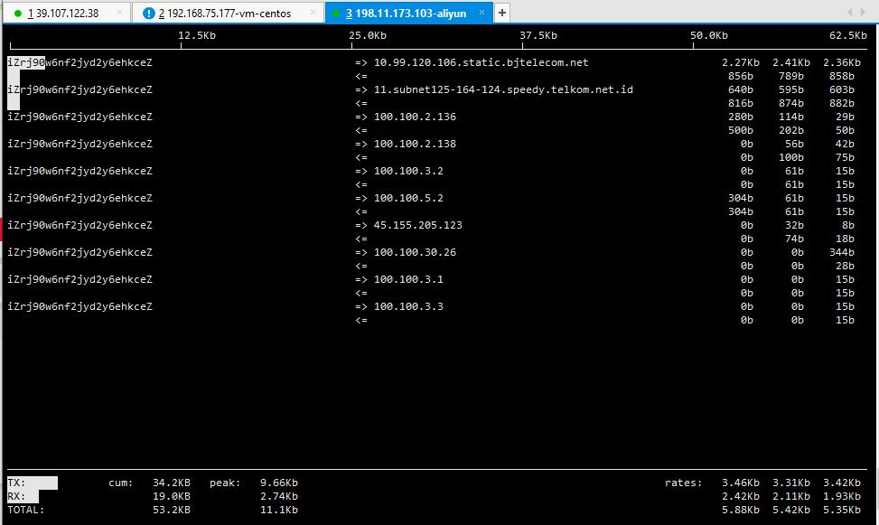

# Linux

- 命令模式下ctrl组合键

    - ctrl + r ： 输入关键字可弹出曾经用过的指令
    
        > 反向搜索执行过的命令。(reverse-i-search) 
        
        > 等同于history|grep xxx 
    
    - ctrl + k ： 剪切光标及其后边的内容
    
    - ctrl + u ： 剪切光标之前的内容
    
    - ctrl + y ： 在光标处粘贴上两个命令，粘贴方式和被剪切方式相同
    
    - ctrl + c ： 结束正在运行的程序或命令
    
    - ctrl + d ： 结束当前命令窗口
    
    - ctrl + l ： 清屏；（和clear效果相同）
    
    - ctrl + a ： 光标切换到行开头；
    
    - ctrl + e ： 光标切换到行尾；


- hostname hostnamectl

    >  查看主机名称
                         
    ```
    # 永久修改主机名称
    sudo hostnamectl set-hostname <newhostname>
    # 临时修改注意名称
    sudo hostname <new-hostname>
    ```
                         
- nohup 
    
    > nohup命令可以将以忽略挂起信号的方式运行起来，被运行的程序的输出信息将不会显示到终端。
      无论是否将nohup命令的输出重定向到终端，输出都将附加到当前目录下的nohup.out文件中。
      如果当前目录的nohup.out文件不可写，输出重定向到$HOME/nohup.out文件中。
      如果没有文件能创建或打开以用于追加，那么command参数指定的命令不可调用。
      如果标准错误是一个终端，那么把指定的命令写给标准错误的所有输出作为标准输出重定向到相同的文件描述符。

    > nohup是永久执行的意思，而 & 是指在后台运行,如果断开ssh连接都不会影响运行。

    > 注意：当我们用 & 运行的程序是守护进程时，我们断开终端后这个守护进程会继续在后台运行。
      如果这个进程不是守护进程时，当我们断开终端后，这个进程也跟着断开停止运行了。

        ```
        
        # 在后台运行test.py重定向输入到test.log
        > nohup /root/test.py > /tmp/test.log 2>&1 &
        
        ```
    
    - 2>&1 解释：
    
    > 将标准错误 2 重定向到标准输出 &1 ，标准输出 &1 再被重定向输入到 runoob.log 文件中。

        0 – stdin (standard input，标准输入)
        1 – stdout (standard output，标准输出)
        2 – stderr (standard error，标准错误输出)

- df du

    > df -h 命令查看磁盘剩余空间

- iostat 

    > iostat -x 1 10

- vmstat

- iotop 

- pidstat 

- top
  
   > 用于实时显示 process 的动态

- iftop 

    -  _yum install iftop -y_
    > 用来监控网卡的实时流量(可以指定网段)、反向解析IP、显示端口信息等。
    
    ```
    [root@psvky ~]# ifconfig 
    eth0: flags=4163<UP,BROADCAST,RUNNING,MULTICAST>  mtu 1500
            inet 172.16.3.234  netmask 255.255.240.0  broadcast 172.16.15.255
            ether 00:16:3e:00:ac:d5  txqueuelen 1000  (Ethernet)
            RX packets 2048  bytes 497843 (486.1 KiB)
            RX errors 0  dropped 0  overruns 0  frame 0
            TX packets 2005  bytes 375064 (366.2 KiB)
            TX errors 0  dropped 0 overruns 0  carrier 0  collisions 0
    
    lo: flags=73<UP,LOOPBACK,RUNNING>  mtu 65536
            inet 127.0.0.1  netmask 255.0.0.0
            loop  txqueuelen 1  (Local Loopback)
            RX packets 36  bytes 4968 (4.8 KiB)
            RX errors 0  dropped 0  overruns 0  frame 0
            TX packets 36  bytes 4968 (4.8 KiB)
            TX errors 0  dropped 0 overruns 0  carrier 0  collisions 0
     
    [root@psvky ~]# iftop -i eth0  [只看eth0网卡 外网]                              
    ```                                     
    

    - 中间的<= =>这两个左右箭头，表示的是流量的方向。
    - TX：发送流量
    - RX：接收流量
    - TOTAL：总流量
    - Cum：运行iftop到目前时间的总流量
    - peak：流量峰值
    - rates：分别表示过去 2s 10s 40s 的平均流量

- iperf

    > 网络性能测试工具。Iperf可以测试最大TCP和UDP带宽性能，具有多种参数和UDP特性，可以根据需要调整，可以报告带宽、延迟抖动和数据包丢失。

- cp

    > copy file 命令主要用于复制文件或目录 
    - 拷贝不覆盖原有的文件
    > awk 'BEGIN { cmd="cp -ri ./demo/* ./test "; print "n" |cmd; }'

- find 
    
    - 查找home目录下类型为文件夹名称保护test字符的所有目录名称
    > find /home/ -type d -name '*test*'

- ls ll

    - 统计当前目录文件个数 
    > ls -R | wc - l
    
- scp
    
    > scp 是 secure copy 的缩写, scp 是 linux 系统下基于 ssh 登陆进行安全的远程文件拷贝命令。
        
- rsync
    
    > 可以实现增量备份的工具。配合任务计划，rsync能实现定时或间隔同步，配合inotify或sersync，可以实现触发式的实时同步。 

 