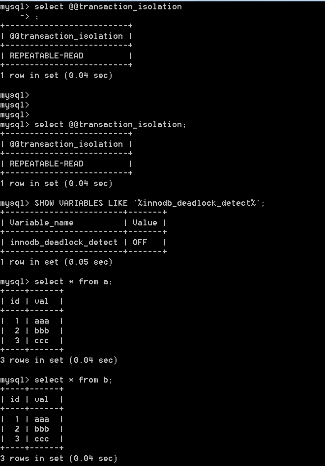
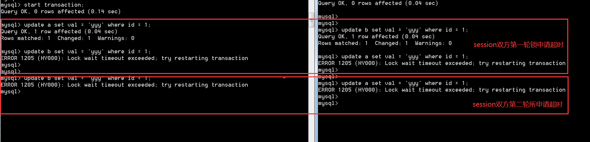

# Mysql

- 查看MySql状态及变量

    - Mysql> show status ——显示状态信息（扩展show status like 'XXX'）
    - Mysql> show variables ——显示系统变量（扩展show variables like 'XXX'）
    - Mysql> show innodb status ——显示InnoDB存储引擎的状态
    - Shell> mysqladmin variables -u username -p password——显示系统变量
    - Shell> mysqladmin extended-status -u username -p password——显示状态信息
    - Shell> mysqld --verbose --help [|more #逐行显示] ——查看状态变量及帮助

## 数据库事务:ACID
    
- 原子性(Atomicity) 

    > 整个事务最终只能是要么成功要么失败，不能存在中间状态，如果发生错误了就需要回滚回去，就像这个事务从来没有执行过一样

- 一致性(Consistency) 

    > 系统要处于一个一致的状态，不能因为并发事务的多少影响到系统的一致性
    
    > 举个典型的例子就是转帐的情况，假设有ABC三个帐号各有100元，那么不管这三个帐号之间怎么转账，整个系统总的额度是300元这一点是应该是不变的。
    
    > 其实ACID里的一致性更多的是应用程序需要考虑的问题，和分布式系统里的CAP里的一致性完全不是一个概念。

- 隔离性(Isolation) 

    > 本质上是解决并发执行的事务如何保证数据库状态是正确的，抽象描述叫可串行化，就是并发的事务在执行的时候效果要求达到看起来像是一个个事务串行执行的效果。
      有冲突的事务之间的隔离性如果保证不了会引起前面的一致性(consistency)也无法满足。
    
    > 每个事务包含多个动作，这些动作如果按照事务本身的顺序依次执行就是所谓的串行执行，这些动作也可以重新排列，
      排列完以后的动作如果效果可以等价于事务串行执行的效果我们就叫做可串行化调度。
    
    > 实际实现的时候往往采用的是冲突可串行化，这个条件比可串行化要求会更高一点，
    规定了一些读写顺序规定了一些访问冲突的情况规定了哪些情况两个事物的动作可以调换哪些是不可以的，
    可以理解为冲突可串行化是可串行化的充分条件。

- 持久性(Durability) 

    > 在事务完成以后所有的修改可以持久的保存在数据库中，一般会采用WAL的方式，
    会把操作提前记录到日志中来保证即使操作还没有刷到磁盘就宕机的情况下有日志可以恢复。
    介绍完事务的ACID属性以后，我们再来分析为什么基于MySQL无法提供严格的分布式事务语义的支持。

## MySQL中的几种日志

- 重做日志（redo log）
- 回滚日志（undo log）
- 二进制日志（bin log）
- 错误日志（error log）
- 慢查询日志（slow query log）
- 一般查询日志（general log）
- 中继日志（relay log）

> 其中重做日志和回滚日志与事务操作息息相关,二进制日志也与事务操作有一定的关系，这三种日志对理解MySQL中的事务操作有着重要的意义

#### 重做日志（redo log）

- 作用

    > 确保事务的持久性。redo log日志记录事务执行后的状态，用来恢复未写入data file的已成功事务更新的数据。
      防止在发生故障的时间点，尚有脏页未写入磁盘，在重启mysql服务的时候，根据redo log进行重做，从而达到事务的持久性这一特性。

- 内容

    > 物理格式的日志，记录的是物理数据页面的修改的信息，其redo log是顺序写入redo log file的物理文件中去的。

- 什么时候产生
　　
    > 事务开始之后就产生redo log，redo log的落盘并不是随着事务的提交才写入的，而是在事务的执行过程中，便开始写入redo log文件中。

- 什么时候释放
　　
    > 当对应事务的脏页写入到磁盘之后，redo log的使命也就完成了，重做日志占用的空间就可以重用（被覆盖）。

- 对应的物理文件：
　　
    > 默认情况下，对应的物理文件位于数据库的data目录下的ib_logfile1&ib_logfile2
                
    - innodb_log_group_home_dir 指定日志文件组所在的路径，默认./ ，表示在数据库的数据目录下。
    - innodb_log_files_in_group 指定重做日志文件组中文件的数量，默认2


- 关于文件的大小和数量，由以下两个参数配置

    - innodb_log_file_size 重做日志文件的大小
    - innodb_mirrored_log_groups 指定了日志镜像文件组的数量，默认1
    
- 补充

    - 很重要一点，redo log是什么时候写盘的？前面说了是在事物开始之后逐步写盘的。
    - 之所以说重做日志是在事务开始之后逐步写入重做日志文件，而不一定是事务提交才写入重做日志缓存，
    - 原因就是，重做日志有一个缓存区Innodb_log_buffer，Innodb_log_buffer的默认大小为8M,
      Innodb存储引擎先将重做日志写入innodb_log_buffer中。

        ```
        mysql> show variables like 'Innodb_log_buffer_size'; 
        +------------------------+---------+
        | Variable_name          | Value   |
        +------------------------+---------+
        | innodb_log_buffer_size | 8388608 |
        +------------------------+---------+
        1 row in set (0.04 sec)
        ```
　　
- 然后会通过以下三种方式将innodb日志缓冲区的日志刷新到磁盘

    - Master Thread 每秒一次执行刷新Innodb_log_buffer到重做日志文件。
    - 每个事务提交时会将重做日志刷新到重做日志文件。
    - 当重做日志缓存可用空间少于一半时，重做日志缓存被刷新到重做日志文件
    
- 由此可以看出，重做日志通过不止一种方式写入到磁盘，尤其是对于第一种方式，Innodb_log_buffer到重做日志文件是Master Thread线程的定时任务。

- 因此重做日志的写盘，并不一定是随着事务的提交才写入重做日志文件的，而是随着事务的开始，逐步开始的。

- 另外引用《MySQL技术内幕 Innodb 存储引擎》（page37）上的原话：

    即使某个事务还没有提交，Innodb存储引擎仍然每秒会将重做日志缓存刷新到重做日志文件。
    这一点是必须要知道的，因为这可以很好地解释再大的事务的提交（commit）的时间也是很短暂的。

#### 回滚日志（undo log）

- 作用
 
    > 保证数据的原子性，保存了事务发生之前的数据的一个版本，可以用于回滚，同时可以提供多版本并发控制下的读（MVCC），也即非锁定读

- 内容 
　　
    > 逻辑格式的日志，在执行undo的时候，仅仅是将数据从逻辑上恢复至事务之前的状态，而不是从物理页面上操作实现的，这一点是不同于redo log的。

- 什么时候产生 
    
    > 事务开始之前，将当前是的版本生成undo log，undo 也会产生 redo 来保证undo log的可靠性

- 什么时候释放 

    > 当事务提交之后，undo log并不能立马被删除，而是放入待清理的链表，
      由purge线程判断是否由其他事务在使用undo段中表的上一个事务之前的版本信息，决定是否可以清理undo log的日志空间。

- 对应的物理文件 

    - MySQL5.6之前，undo表空间位于共享表空间的回滚段中，共享表空间的默认的名称是ibdata，位于数据文件目录中。
    - MySQL5.6之后，undo表空间可以配置成独立的文件，但是提前需要在配置文件中配置，完成数据库初始化后生效且不可改变undo log文件的个数
        > 如果初始化数据库之前没有进行相关配置，那么就无法配置成独立的表空间了。 

- 关于MySQL5.7之后的独立undo表空间配置参数如下 

    - undo独立表空间的存放目录
    > innodb_undo_directory = /data/undospace/  
    - 回滚段为128KB
    > innodb_undo_logs = 128  
    - 指定有4个undo log文件
    > innodb_undo_tablespaces = 4 
    
- 如果undo使用的共享表空间，这个共享表空间中又不仅仅是存储了undo的信息，
  共享表空间的默认为与MySQL的数据目录下面，其属性由参数innodb_data_file_path配置。
  
    ```
    mysql> show variables like 'innodb_data_file_path';
    +-----------------------+------------------------+
    | Variable_name         | Value                  |
    +-----------------------+------------------------+
    | innodb_data_file_path | ibdata1:10M:autoextend |
    +-----------------------+------------------------+
    1 row in set (0.04 sec)
    ```

- 补充

    - undo是在事务开始之前保存的被修改数据的一个版本，产生undo日志的时候，同样会伴随类似于保护事务持久化机制的redo log的产生
    - 默认情况下undo文件是保持在共享表空间的，也即ibdatafile文件中
    - 当数据库中发生一些大的事务性操作的时候，要生成大量的undo信息，全部保存在共享表空间中的
    - 因此共享表空间可能会变的很大，默认情况下，也就是undo 日志使用共享表空间的时候，被“撑大”的共享表空间是不会也不能自动收缩的
    - 因此，mysql5.7之后的“独立undo 表空间”的配置就显得很有必要了。

#### 二进制日志（binlog）

- 作用

    - 用于复制，在主从复制中，从库利用主库上的binlog进行重播，实现主从同步
    - 用于数据库的基于时间点的还原

- 内容

    - 逻辑格式的日志，可以简单认为就是执行过的事务中的sql语句
    - 但又不完全是sql语句这么简单，而是包括了执行的sql语句（增删改）反向的信息
        - delete对应着delete本身和其反向的insert
        - update对应着update执行前后的版本的信息
        - insert对应着delete和insert本身的信息
      
    - 在使用mysqlbinlog解析binlog之后一些都会真相大白
    - 因此可以基于binlog做到类似于oracle的闪回功能，其实都是依赖于binlog中的日志记录

- 什么时候产生

    - 事务提交的时候，一次性将事务中的sql语句（一个事物可能对应多个sql语句）按照一定的格式记录到binlog中
    - 这里与redo log很明显的差异就是redo log并不一定是在事务提交的时候刷新到磁盘，redo log是在事务开始之后就开始逐步写入磁盘
    - 因此对于事务的提交，即便是较大的事务，提交（commit）都是很快的，但是在开启了bin_log的情况下，对于较大事务的提交，可能会变得比较慢一些
    - 这是因为binlog是在事务提交的时候一次性写入的造成的，这些可以通过测试验证

- 什么时候释放

    - binlog的默认是保持时间由参数expire_logs_days配置
        > 也就是说对于非活动的日志文件,在生成时间超过expire_logs_days配置的天数之后，会被自动删除

        ```
        mysql> show variables like 'expire_logs_days';
        +------------------+-------+
        | Variable_name    | Value |
        +------------------+-------+
        | expire_logs_days | 0     |
        +------------------+-------+
        1 row in set (0.05 sec)
        ```
    - MySQL默认expire_logs_days=0，是不会自动删除日志文件的。如果日志文件过大，且业务需要，只能手动归档压缩备份

- 对应的物理文件

    - 配置文件的路径为log_bin_basename，binlog日志文件按照指定大小，当日志文件达到指定的最大的大小之后，进行滚动更新，生成新的日志文件。
    - 对于每个binlog日志文件，通过一个统一的index文件来组织
  
        ```
        mysql> show variables like 'log_bin_basename';
        +------------------+--------------------------+
        | Variable_name    | Value                    |
        +------------------+--------------------------+
        | log_bin_basename | C:\wamp64\logs\mysql-bin |
        +------------------+--------------------------+
        1 row in set (0.06 sec)
        ```

- 补充

    - 二进制日志的作用之一是还原数据库的，这与redo log很类似，很多人混淆过，但是两者有本质的不同
        - 作用不同
            - redo log是保证事务的持久性的，是事务层面的 
            - binlog作为还原的功能，是数据库层面的（当然也可以精确到事务层面的），虽然都有还原的意思，但是其保护数据的层次是不一样的。
        - 内容不同 
            - redo log是物理日志，是数据页面的修改之后的物理记录 
            - binlog是逻辑日志，可以简单认为记录的就是sql语句
　　
    - 另外，两者日志产生的时间，可以释放的时间，在可释放的情况下清理机制，都是完全不同的
    - 恢复数据时候的效率，基于物理日志的redo log恢复数据的效率要高于语句逻辑日志的binlog
    - 关于事务提交时，redo log和binlog的写入顺序
        > 为了保证主从复制时候的主从一致（当然也包括使用binlog进行基于时间点还原的情况）,
        是要严格一致的，MySQL通过两阶段提交过程来完成事务的一致性的，也即redo log和binlog的一致性的，
        理论上是先写redo log，再写binlog，两个日志都提交成功（刷入磁盘），事务才算真正的完成

#### 错误日志（error log）

> 错误日志记录着mysqld启动和停止,以及服务器在运行过程中发生的错误的相关信息
- 在默认情况下，系统记录错误日志的功能是关闭的，错误信息被输出到标准错误输出
- 指定日志路径两种方法:
    - 编辑my.cnf 写入 log-error=[path]
    - 通过命令参数错误日志 mysqld_safe –user=mysql –log-error=[path] &
- 显示错误日志的命令,如下所示:
    ```
    mysql> show variables like '%err%';
    +---------------------+-------------------------------+
    | Variable_name       | Value                         |
    +---------------------+-------------------------------+
    | binlog_error_action | ABORT_SERVER                  |
    | error_count         | 0                             |
    | log_error           | C:\wamp64\logs\mysqld_err.log |
    | log_error_verbosity | 2                             |
    | max_connect_errors  | 100                           |
    | max_error_count     | 64                            |
    | slave_skip_errors   | OFF                           |
    +---------------------+-------------------------------+
    7 rows in set (0.07 sec)
    ```

#### 普通查询日志（general query log）
- 记录了服务器接收到的每一个查询或是命令
- 无论这些查询或是命令是否正确甚至是否包含语法错误，general log 都会将其记录下来 ，记录的格式为 {Time ，Id ，Command，Argument }
- 也正因为mysql服务器需要不断地记录日志，开启General log会产生不小的系统开销 
- 因此，Mysql默认是把General log关闭的
- 查看普通查询日志的存放方式
    ```
    mysql> show variables like 'log_output';
    +---------------+-------+
    | Variable_name | Value |
    +---------------+-------+
    | log_output    | FILE  |
    +---------------+-------+
    1 row in set (0.06 sec)
    
    # 如果设置log_output=table,日志结果会记录到名为gengera_log的表中，这表的默认引擎都是CSV
    mysql> set global log_output='table';
    # 如果设置log_output=file，则日志结果会记录到文件中
    mysql> set global log_output='file';
    # 设置general log的日志文件路径
    mysql> set global general_log_file='c:\wamp64\bin\mysql\mysql5.7.14\data\zjl.log';
    # 开启general log
    mysql> set global general_log=on;
    # 关闭general log
    mysql> set global general_log=off;
    
    mysql> show global variables like '%general%';
    +------------------+----------------------------------------------+
    | Variable_name    | Value                                        |
    +------------------+----------------------------------------------+
    | general_log      | ON                                           |
    | general_log_file | c:\wamp64\bin\mysql\mysql5.7.14\data\zjl.log |
    +------------------+----------------------------------------------+
    2 rows in set (0.07 sec)
    ```
#### 慢查询日志（slow query log）

- 用来记录在MySQL中响应时间超过阀值的语句，具体指运行时间超过long_query_time值的SQL，则会被记录到慢查询日志中
- 慢日志只会记录执行成功的语句
- long_query_time的默认值为10，意思是运行10S以上的语句
- 默认情况下Mysql数据库并不启动慢查询日志，如果不是调优需要的话，一般不建议启动该参数，因为开启慢查询日志会或多或少带来一定的性能影响
- 慢查询日志支持将日志记录写入文件，也支持将日志记录写入数据库表

- 相关参数解释：

    - slow_query_log    ：是否开启慢查询日志，1表示开启，0表示关闭。
    
    - log-slow-queries  ：旧版（5.6以下版本）MySQL数据库慢查询日志存储路径。可以不设置该参数，系统则会默认给一个缺省的文件host_name-slow.log
    
    - slow-query-log-file：新版（5.6及以上版本）MySQL数据库慢查询日志存储路径。可以不设置该参数，系统则会默认给一个缺省的文件host_name-slow.log
    
    - long_query_time ：慢查询阈值，当查询时间多于设定的阈值时，记录日志。
    
    - log_queries_not_using_indexes：未使用索引的查询也被记录到慢查询日志中（可选项）。
    
    - log_output：日志存储方式
    
        - log_output='FILE'表示将日志存入文件，默认值是'FILE'
        - log_output='TABLE'表示将日志存入数据库，这样日志信息就会被写入到mysql.slow_log表中
        - MySQL数据库支持同时两种日志存储方式，配置的时候以逗号隔开即可，如：log_output='FILE,TABLE'
            > 日志记录到系统的专用日志表中，要比记录到文件耗费更多的系统资源，建议优先记录到文件

    ```
    # 开始慢日志
    mysql> set global slow_query_log = 1;
    Query OK, 0 rows affected (0.00 sec)
    # 查看慢查询配置情况
    mysql> show status like '%slow_queries%';
    +---------------+-------+
    | Variable_name | Value |
    +---------------+-------+
    | Slow_queries  | 0     |
    +---------------+-------+
    1 row in set (0.06 sec)
    # 查看慢查询时间 
    mysql> show variables like 'long_query_time';
    +-----------------+-----------+
    | Variable_name   | Value     |
    +-----------------+-----------+
    | long_query_time | 10.000000 |
    +-----------------+-----------+
    1 row in set (0.06 sec)
    # 查看慢查询日志路径
    mysql> show variables like '%slow%';
    +---------------------------+---------------------------------------------------+
    | Variable_name             | Value                                             |
    +---------------------------+---------------------------------------------------+
    | log_slow_admin_statements | OFF                                               |
    | log_slow_slave_statements | OFF                                               |
    | slow_launch_time          | 2                                                 |
    | slow_query_log            | ON                                                |
    | slow_query_log_file       | c:\wamp64\bin\mysql\mysql5.7.14\data\zjl-slow.log |
    +---------------------------+---------------------------------------------------+
    5 rows in set (0.06 sec)
    ```

#### 中继日志（relay log）
- 中继日志用于主从复制架构中的从服务器上
    > 从服务器的 slave 进程从主服务器处获取二进制日志的内容并写入中继日志，然后由 IO 进程读取并执行中继日志中的语句。
- relay log 相关参数一般在从库设置，几个相关参数介绍如下
    - relay_log：定义 relay log 的位置和名称
    - relay_log_purge：是否自动清空不再需要中继日志，默认值为1(启用)
    - relay_log_recovery：当 slave 从库宕机后,
      假如 relay log 损坏了，导致一部分中继日志没有处理，则自动放弃所有未执行的 relay log,
      并且重新从 master 上获取日志，这样就保证了 relay log 的完整性。
      默认情况下该功能是关闭的，将 relay_log_recovery 的值设置为1可开启此功能
      
- relay log 默认位置在数据文件的目录，文件名为host_name-relay-bin，可以自定义文件位置及名称
    
- relay log 相关配置,从库端设置
    ```
    vim /etc/my.cnf 
    [mysqld]
    relay_log = /data/mysql/logs/relay-bin
    relay_log_purge = 1
    relay_log_recovery = 1
    ```

## 存储过程    


## 系统变量
-  死锁检测

    MySQL Server层的自动检测机制，可以及时发现两个或者多个session间互斥资源的申请造成的死锁，
    且会自动回滚一个（或多个）事物代价相对较小的session，让执行代价最大的先执行。
    该参数默认就是打开的，按理说也是必须要打开的，甚至在其他数据库中没有可以使其关闭的选项。
    
- innodb_deadlock_detect 用于控制系统是否执行innodb死锁检查
    
    - 版本： >= 5.7.15 或者 8.0
    - 默认值：ON
    - 作用：该选项使用了禁用MySQL的死锁检测功能的。
        > 在高并发系统上，当许多线程等待同一个锁时，死锁检测可能导致速度减慢。 
        > 有时，当发生死锁时，如果禁用了死锁检测则可能会更有效，这样可以依赖innodb_lock_wait_timeout的设置进行事务回滚。

    - DBA在秒杀活动保障的时候一般会有哪些保障措施呢？          
        > 其实发生秒杀活动之前，我们的整体系统已经做了准备。
        到秒杀的时候，DBA会关注数据库总体的tps，thread_running ，慢查询等。
        我们的快照系统会自动探测数据库的压力，并作出关闭死锁检测和放宽双一的限制，
        提高瞬时update 的性能。等压力下降，系统会自动关闭优化。

    > MySQL默认情况下是开启了死锁检测的，InnoDB自动检测发送死锁的事务，并回滚其中的一个事务或所有导致死锁的事务。InnoDB会在导致死锁的十五中选择一个权重比较小的事务来回滚，这个权重值可能是由该事务insert, updated, deleted的行数决定的。
    
    > 如果innodb_table_locks = 1(默认值)并且autocommit = 0，则InnoDB能感知到表锁的存在，并且上层的MySQL层知道行级锁。
    否则，InnoDB无法检测到由MySQL LOCK TABLES语句设置的表锁或由除InnoDB之外的存储引擎设置的锁定的死锁。 
    通过设置innodb_lock_wait_timeout系统变量的值来解决这些情况。
    
    > 当InnoDB执行事务的完全回滚时，将释放由事务设置的所有锁。 
    但是，如果单个SQL语句由于错误而回滚，则语句设置的某些锁可能会被保留。 
    这是因为InnoDB以一种格式存储行锁，以致之后不能知道哪个锁由哪个语句设置。
    
    > 如果SELECT调用事务中存储的函数，并且函数中的语句失败，则该语句将回滚。 
    此外，如果在此之后执行ROLLBACK，整个事务将回滚。
    
    > 如果InnoDB监控器输出的最近死锁检测部分包含一条消息，指出TOO DEEP OR LONG SEARCH IN THE LOCK TABLE WAITS-FOR GRAPH,
    WE WILL ROLL BACK FOLLOWING TRANSACTION，这表示处于等待的事务列表长度已达到限制200。
    超过200个事务的等待列表被视为死锁，并且将回滚尝试检查等待列表的事务。 
    如果锁定线程必须查看等待列表上的事务拥有的超过1,000,000个锁，则也可能发生相同的错误。

	> 如果关闭innodb_deadlock_detect，也即关闭了死锁自动监测机制时，当两个或多个session间存在死锁的情况下，MySQL怎么去处理？
    这里会涉及到另外一个参数：锁超时，也即innodb_lock_wait_timeout，该参数指定了“锁申请时候的最长等待时间”
    官方的解释是：The length of time in seconds an InnoDB transaction waits for a row lock before giving up.
    innodb_lock_wait_timeout默认值是50秒，也就是意味着session请求时，申请不到锁的情况下最多等待50秒钟，
	然后呢，就等价于死锁，自动回滚当前事物了？其实不是的，事情没有想象中的简单。

- innodb_rollback_on_timeout

    - 默认值：OFF
    - 作用：该参数的决定了当前请求锁超时之后，回滚的是整个事物，还是仅当前语句
    - 官方的解释是：InnoDB rolls back only the last statement on a transaction timeout by default。
    > 默认值是off，也就是回滚当前语句（放弃当前语句的锁申请），有人强烈建议打开这个选项（on），也就是一旦锁申请超时，就回滚整个事物。
    需要注意的是，默认情况下只回滚当前语句，而不是整个事物，当前的事物还在继续，连接也还在，这里与死锁自动监测机制打开之后会主动牺牲一个事物不同，
    锁超时后并不会主动牺牲其中任何一个事物。这意味着会出现一种非常严重的情况，
    - 举个例子，可以想象一下如下这种情况：
    ```
    session1 　　　　　　　　　　　　　　　　　　　　　   session2
    start transaction;　　　　　　　　　　　　　　　　  start transaction;
    update T1 set val = '111' where id = 1　　　　  update T2 set val = '222' where id = 1　
    ……　　　　　　　　　　　　　　　　　　　　　 　　　     ……
    update T2 set val = '111' where id = 1　　　　  update T1 set val = '222' where id = 1
    
    if 锁超时　　　　　　　　　　　　　　　　　　　 　　   if 锁超时
    　  #继续申请锁　　　　　　　　　　　　　　　　　　　      #继续申请锁
    　  update T2 set val = '111' where id = 1　　　   update T1 set val = '222' where id = 1
    ```
    关闭了死锁监测机制后，在innodb_rollback_on_timeout保持默认的off的情况下，session1和session2都是无法正常执行下去的，且永远都无法执行下去。
    任意一个session出现锁超时，放弃当前的语句申请的锁，而不是整个事物持有的锁，当前session并不释放其他session请求的锁资源，
    即便是继续下去，依旧如此，两者又陷入了相互等待，相互锁请求超时，继续死循环。
    从这里可以看到，与死锁自动检测机制在发现死锁是主动选择一个作为牺牲品不同，一旦关闭了innodb_deadlock_detect，Session中的任意一方都不会主动释放已经持有的锁。
    此时如果应用程序如果不足够的健壮，继续去申请锁（比如重试机制，尝试重试相关语句），session双方会陷入到无限制的锁超时死循环之中。

    事实上推论是不是成立的？做个测试验证一下，数据库环境信息如下
    
    模拟事物双方在当前语句的锁超时之后，继续申请锁，确实是会出现无限制的锁超时的死循环之中。
    
    以上就比较有意思了，与死锁主动监测并牺牲其中一个事物不同，此时事物双方互不相让，当然也都无法成功执行。

    这只不过是一个典型的负面场景，除此之外，还会有哪些问题值得思考？
    
        1，因为事物无法快速提交或者回滚，那么连接持有的时间会增加，一旦并发量上来，连接数可能成为一个问题。
        2，锁超时时间肯定要设置为一个相对较小的时间，但具体又设置为多少靠谱。
        3，关闭死锁检测，带来的收益，与副作用相比哪个更高，当前业务类型是否需要关闭死锁检测，除非数据库中相关操作大部分都是短小事物且所冲突的可能性较低。
        4，面对锁超时，应用程序端如何合理地处理锁超时的情况，是重试还是放弃。
        5，与此关联的innodb_rollback_on_timeout如何设置，是保持默认的关闭（锁超时的情况下，取消当前语句的所申请），还是打开（锁超时的情况下，回滚整个事物）

    最后，其实这个问题属于一个系统工程，不是一个单点问题，除此之外还有可能潜在一些其他的问题，原作者是大神，当然是一个整体方案，需要在整体架构上做处理，作者也给出了一个客观的处理方式。
    
    
    - 关于innodb_deadlock_detect参数，这里有一篇比较好的文章，来源：https://www.fromdual.com/comment/1018
    
        以下为译文：
        最近，我们有一位新客户，他时不时遇到大量他无法理解的数据库问题。当我们查看 MySQL 配置文件 （my.cnf） 时，我们发现此客户已禁用 InnoDB 死锁检测 （innodb_deadlock_detect）。
        因为到目前为止，我们建议不要这样做，但在实践中我从未偶然发现过这个问题，所以我对MySQL变量innodb_deadlock_detect进行了更多的调查。
        MySQL 文档告诉我们以下 {1}：
        
        禁用死锁检测
        在高并发系统上，当许多线程等待同一锁时，死锁检测可能会导致速度变慢。有时，禁用死锁检测并依赖于innodb_lock_wait_timeout设置以在发生死锁时进行事务回滚可能更有效。可以使用innodb_deadlock_detect配置选项禁用死锁检测。
        关于参数innodb_deadlock_detect本身 [2] ：
        
        此选项用于禁用死锁检测。在高并发系统上，当许多线程等待同一锁时，死锁检测可能会导致速度变慢。有时，禁用死锁检测并依赖于innodb_lock_wait_timeout设置以在发生死锁时进行事务回滚可能更有效。
        问题是，每次 MySQL 执行 （行）锁或表锁时，如果锁导致死锁，都会进行检查。这个检查的代价很高。顺便说一下：禁用InnoDB死锁检测的功能是由Facebook为WebScaleSQL开发的[3]。
        
        相关功能可在 [4] 中找到：
        ```
        class DeadlockChecker, method check_and_resolve (DeadlockChecker::check_and_resolve)
        Every InnoDB (row) Lock (for mode LOCK_S or LOCK_X) and type ORed with LOCK_GAP or LOCK_REC_NOT_GAP, ORed with LOCK_INSERT_INTENTION
        Enqueue a waiting request for a lock which cannot be granted immediately.
        lock_rec_enqueue_waiting()
        ```
        和
        ```
        Every (InnoDB) Table Lock
        Enqueues a waiting request for a table lock which cannot be granted immediately. Checks for deadlocks.
        lock_table_enqueue_waiting()
        ```
        这意味着，如果变量innodb_deadlock_detect为每个锁定（行或表）启用（= 默认值），则检查该变量（如果导致死锁）。
        如果禁用该变量，则检查未完成（速度更快），事务将挂起（死）锁定，直到释放锁定或超过innodb_lock_wait_timeout时间（默认 50 秒）。然后 InnoDB 锁定等待超时（探测器？）罢工并杀死事务。
        ```
        SQL> SHOW GLOBAL VARIABLES LIKE 'innodb_lock_wait%';
        +--------------------------+-------+
        | Variable_name            | Value |
        +--------------------------+-------+
        | innodb_lock_wait_timeout | 50    |
        +--------------------------+-------+
        ```
        这意味着，停用 InnoDB 死锁检测是有趣的，如果你有许多（如 Facebook一样）短小事物，你期望现在很少发生冲突。此外，建议将 MySQL 变量innodb_lock_wait_timeout设置为非常小的值（几秒）。
        
        因为我们的大多数客户没有 Facebook 的规模，因为他们没有那么多并发的短交易和小交易，而是很少但交易多（可能有许多锁，因此存在高死锁概率），我可以想象，禁用此参数是客户系统的hickup（锁堆积）的原因。
        这导致超过max_connections，最后整个系统崩溃。
        
        因此，我强烈建议，让InnoDB死锁检测启用。除了你知道你在做什么（经过大约2周的广泛测试和测量）。
        
    - 参考链接:
        https://www.cnblogs.com/wy123/p/12724252.html
        https://mp.weixin.qq.com/s/Lc_tQEK55r_syapebSu0Cg
        https://dev.mysql.com/doc/refman/5.7/en/innodb-parameters.html#sysvar_innodb_lock_wait_timeout

####  调优设置
- 有关请求连接的变量

    - max_connections 
    
        > 指MySql的最大连接数，如果服务器的并发连接请求量比较大，建议调高此值，以增加并行连接数量，
        当然这建立在机器能支撑的情况下，因为如果连接数越多，介于MySql会为每个连接提供连接缓冲区，
        就会开销越多的内存，所以要适当调整该值，不能盲目提高设值。
        可以过'conn%'通配符查看当前状态的连接数量，以定夺该值的大小

    - back_log 
    
        > 是指要求MySQL能有的连接数量。当主要MySQL线程在一个很短时间内得到非常多的连接请求，
        这就起作用，然后主线程花些时间(尽管很短)检查连接并且启动一个新线程。
        back_log值指出在MySQL暂时停止回答新请求之前的短时间内多少个请求可以被存在堆栈中。
        如果期望在一个短时间内有很多连接，你需要增加它。
        也就是说，如果MySql的连接数据达到max_connections时，
        新来的请求将会被存在堆栈中，以等待某一连接释放资源，该堆栈的数量即back_log，
        如果等待连接的数量超过back_log，将不被授予连接资源。
        另外，这值（back_log）限于您的操作系统对到来的TCP/IP连接的侦听队列的大小。
        你的操作系统在这个队列大小上有它自己的限制（可以检查你的OS文档找出这个变量的最大值），
        试图设定back_log高于你的操作系统的限制将是无效的。

- 缓冲区变量

    > 来看看那些在启动时就需要分配并且总是存在的全局缓冲

    - 全局缓冲  
    
        - key_buffer_size
            > 决定索引处理的速度，尤其是索引读的速度。一般我们设为16M，通过检查状态值Key_read_requests和Key_reads，
            可以知道key_buffer_size设置是否合理。比例key_reads/key_read_requests应该尽可能的低，
            至少是1:100，1:1000更好（上述状态值可以使用'key_read%'获得用来显示状态数据）。
            key_buffer_size只对MyISAM表起作用。即使你不使用MyISAM表，但是内部的临时磁盘表是MyISAM表，也要使用该值。
            可以使用检查状态值'created_tmp_disk_tables'得知详情。

        - innodb_buffer_pool_size
        
            > 对于InnoDB表来说，作用就相当于key_buffer_size对于MyISAM表的作用一样。
            InnoDB使用该参数指定大小的内存来缓冲数据和索引。
            对于单独的MySQL数据库服务器，最大可以把该值设置成物理内存的80%。

        - innodb_additional_mem_pool_size
            
            > 指定InnoDB用来存储数据字典和其他内部数据结构的内存池大小。缺省值是1M。
             通常不用太大，只要够用就行，应该与表结构的复杂度有关系。
             如果不够用，MySQL会在错误日志中写入一条警告信息。
            
        - innodb_log_buffer_size
        
            > 指定InnoDB用来存储日志数据的缓存大小，如果您的表操作中包含大量并发事务（或大规模事务），
            并且在事务提交前要求记录日志文件，请尽量调高此项值，以提高日志效率。

        - query_cache_size
        
            > 是MySql的查询缓冲大小。（从4.0.1开始，MySQL提供了查询缓冲机制）使用查询缓冲，
            MySQL将SELECT语句和查询结果存放在缓冲区中，今后对于同样的SELECT语句（区分大小写），
            将直接从缓冲区中读取结果。根据MySQL用户手册，使用查询缓冲最多可以达到238%的效率。
            通过检查状态值’Qcache_%’，可以知道query_cache_size设置是否合理：
            如果Qcache_lowmem_prunes的值非常大，则表明经常出现缓冲不够的情况，
            如果Qcache_hits的值也非常大，则表明查询缓冲使用非常频繁，此时需要增加缓冲大小；
            如果Qcache_hits的值不大，则表明你的查询重复率很低，
            这种情况下使用查询缓冲反而会影响效率，那么可以考虑不用查询缓冲。
            此外，在SELECT语句中加入SQL_NO_CACHE可以明确表示不使用查询缓冲。

        > 注：如果你大量地使用MyISAM表，那么你也可以增加操作系统的缓存空间使得MySQL也能用得着。
        把这些也都加到操作系统和应用程序所需的内存值之中，可能需要增加32MB甚至更多的内存给MySQL服务器代码以及各种不同的小静态缓冲。
        这些就是你需要考虑的在MySQL服务器启动时所需的内存。其他剩下的内存用于连接。

    - 连接缓冲:MySql为每个连接发放连接缓冲

        > 每个连接到MySQL服务器的线程都需要有自己的缓冲。大概需要立刻分配256K，甚至在线程空闲时，
        它们使用默认的线程堆栈，网络缓存等。事务开始之后，则需要增加更多的空间。
        运行较小的查询可能仅给指定的线程增加少量的内存消耗，然而如果对数据表做复杂的操作例如扫描、排序或者需要临时表，
        则需分配大约read_buffer_size，sort_buffer_size，read_rnd_buffer_size，tmp_table_size 大小的内存空间。
        不过它们只是在需要的时候才分配，并且在那些操作做完之后就释放了。有的是立刻分配成单独的组块。
        tmp_table_size 可能高达MySQL所能分配给这个操作的最大内存空间了。注意，这里需要考虑的不只有一点,
        可能会分配多个同一种类型的缓存，例如用来处理子查询。一些特殊的查询的内存使用量可能更大,如果在MyISAM表
        上做成批的插入时需要分配 bulk_insert_buffer_size 大小的内存；
        执行 ALTER TABLE， OPTIMIZE TABLE， REPAIR TABLE 命令时需要分配 myisam_sort_buffer_size 大小的内存。

        - read_buffer_size 
        
        > MySql读入缓冲区大小。对表进行顺序扫描的请求将分配一个读入缓冲区，MySql会为它分配一段内存缓冲区。
        read_buffer_size变量控制这一缓冲区的大小。如果对表的顺序扫描请求非常频繁，并且你认为频繁扫描进行得太慢，
        可以通过增加该变量值以及内存缓冲区大小提高其性能。

        - sort_buffer_size 
        > MySql执行排序使用的缓冲大小。如果想要增加ORDER BY的速度，首先看是否可以让MySQL使用索引而不是额外的排序阶段。
        如果不能，可以尝试增加sort_buffer_size变量的大小

        - read_rnd_buffer_size 
        > MySql的随机读缓冲区大小。当按任意顺序读取行时(例如，按照排序顺序)，将分配一个随机读缓存区。
        进行排序查询时，MySql会首先扫描一遍该缓冲，以避免磁盘搜索，提高查询速度，如果需要排序大量数据，
        可适当调高该值。但MySql会为每个客户连接发放该缓冲空间，所以应尽量适当设置该值，以避免内存开销过大。

        - tmp_table_size
        > MySql的heap （堆积）表缓冲大小。所有联合在一个DML指令内完成，并且大多数联合甚至可以不用临时表即可以完成。
        大多数临时表是基于内存的(HEAP)表。具有大的记录长度的临时表 (所有列的长度的和)或包含BLOB列的表存储在硬盘上。
        如果某个内部heap（堆积）表大小超过tmp_table_size，MySQL可以根据需要自动将内存中的heap表改为基于硬盘的MyISAM表。
        还可以通过设置tmp_table_size选项来增加临时表的大小。也就是说，如果调高该值，MySql同时将增加heap表的大小，
        可达到提高联接查询速度的效果。

    > 当我们设置好了缓冲区大小之后，再来看看

    - table_cache/table_open_cache[版本5.1.3之后的名称二者作用相同]
        >主要用于设置table高速缓存的数量。由于每个客户端连接都会至少访问一个表，因此此参数的值与max_connections有关。
        所有线程打开的表的数目，增大该值可以增加mysqld需要的文件描述符的数量。
        每当MySQL访问一个表时，如果在表缓冲区中还有空间，该表就被打开并放入其中，这样可以更快地访问表内容。
        通过检查峰值时间的状态值’Open_tables’和’Opened_tables’，可以决定是否需要增加table_cache的值。
        如果你发现open_tables等于table_cache，并且opened_tables在不断增长，
        那么你就需要增加table_cache的值了（上述状态值可以使用’Open%tables’获得）。
        注意，不能盲目地把table_cache设置成很大的值。如果设置得太高，可能会造成文件描述符不足，从而造成性能不稳定或者连接失败。
        如果对此参数的把握不是很准，比较保守的设置建议：把MySQL数据库放在生产环境中试运行一段时间，
        然后把参数的值调整得比Opened_tables的数值大一些，并且保证在比较高负载的极端条件下依然比Opened_tables略大

    - 其他

    > 只有简单查询OLTP（联机事务处理）应用的内存消耗经常是使用默认缓冲的每个线程小于1MB，除非需要使用复杂的查询否则无需增加每个线程的缓冲大小。
    使用1MB的缓冲来对10行记录进行排序和用16MB的缓冲基本是一样快的（实际上16MB可能会更慢，不过这是其他方面的事了）。

    > 找出MySQL服务器内存消耗的峰值。就比较能计算出操作系统所需的内存、文件缓存以及其他应用。
    在32位环境下，还需要考虑到32位的限制，限制 “mysqld” 的值大约为2.5G（实际上还要考虑到很多其他因素）。
    现在运行 “ps aux” 命令来查看 “VSZ” 的值（MySQL 进程分配的虚拟内存）。
    监视着内存变化的值，就能知道是需要增加或减少当前的内存值了。

    - 设置方法：
    
        > 安装好MySql后，配制文件应该在MySql安装目录下的./share/mysql目录中，配制文件：
            my-huge.cnf my-medium.cnf my-large.cnf my-small.cnf
        win环境下即存在于MySql安装目录中的.ini文件。不同的流量的网站和不同配制的服务器环境，当然需要有不同的配制文件了。
            一般的情况下，my-medium.cnf这个配制文件就能满足我们的大多需要；
            一般我们会把配置文件拷贝到 /etc/my.cnf ，win环境下则拷备到 my.ini 下即可，只需要修改这个配置文件就可以了。

## 其他

- 自增列持有化
   
   - mysql5.7以前innodb自增列计数器（AUTO_INCREMENT）的值只存储在内存中  
   - mysql8.0每次变化时讲自增列最大值写入redo log,同时在每次检查点将其写入引擎的私有系统表  